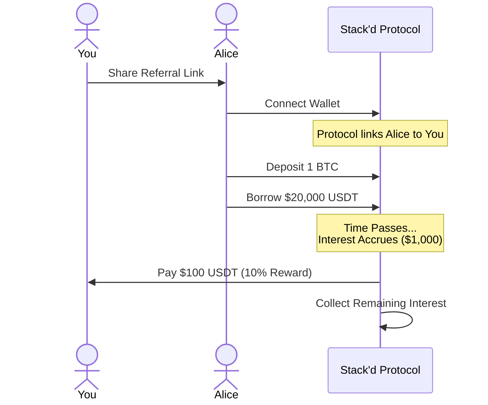

# Rewards Program

Earn passive income by inviting friends to Stack'd.

## How it Works
The Stack'd Rewards Program is simple: **You earn a commission every time your referrals pay interest on their loans.**

*   **Commission Rate**: You earn **10%** of the interest paid by people you refer.
*   **Payout**: Rewards are paid in **USDT**.
*   **Claiming**: You can claim your earnings to your wallet at any time.

This is not a one-time bonus. As long as your friends have an active loan and are accruing interest, you are earning rewards. It is a true passive income stream.

---

## Example Walkthrough

Let's look at how much you could earn.

### 1. The Setup
*   **You** invite your friend **Alice** using your unique referral link.
*   Alice connects her wallet. The protocol now links her wallet to yours forever.

### 2. The Loan
*   Alice deposits 1 BTC and borrows **$20,000 USDT**.
*   The interest rate (APR) is **5%**.

### 3. The Interest
Over the course of one year, Alice's loan accrues interest:
*   $20,000 * 5% = **$1,000** in total interest for the year.

### 4. Your Reward
When Alice repays her interest (or as it accrues), the protocol calculates your share:
*   Your Share = 10% of Interest
*   **You earn $100 USDT.**

### Scale it up
If you invite **10 friends** like Alice, you would earn **$1,000 / year** just for introducing them to the platform.

---

## How to Start
1.  Go to the **Rewards** tab in the Stack'd App.
2.  Copy your unique **Referral Link**.
3.  Share it on Twitter, Telegram, or directly with friends.
4.  Track your "Total Referred Volume" and "Unclaimed Earnings" on the dashboard.
